##### Experiment 1

Train the classifier

1. label smoothing 0.1
2. class weights used
3. learning rate 3e-4
4. weight decay 1e-4
4. lr schedular CosineAnnealingLR
5. optimizer AdamW

- epochs given - 3
- epochs completed - 3
- model final accuracy - 0.45305

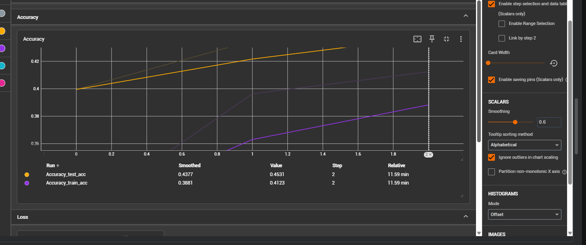
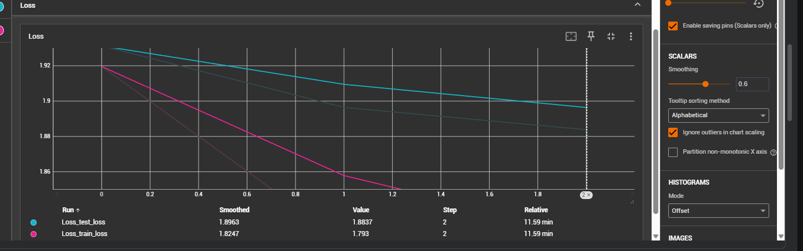

##### Experiment 2

Train the complete model with this configuration

1. label smoothing 0.1
2. class weights used
3. learning rate 3e-4
4. weight decay 1e-4
4. lr schedular CosineAnnealingLR
5. optimizer AdamW

- epochs given - 20
- epochs completed - 9
- model final accuracy - 0.684870

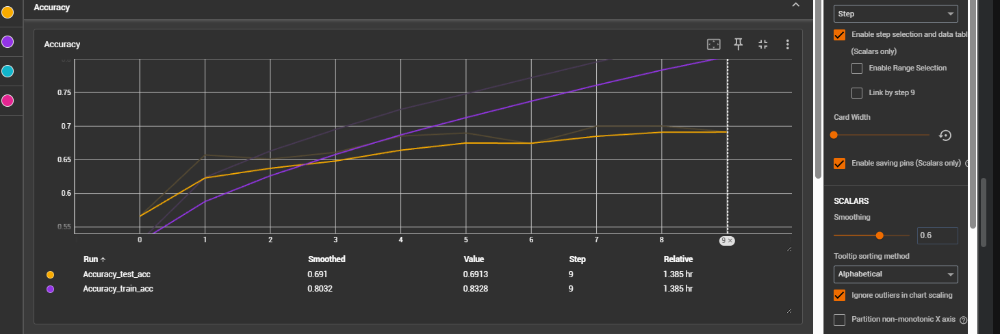
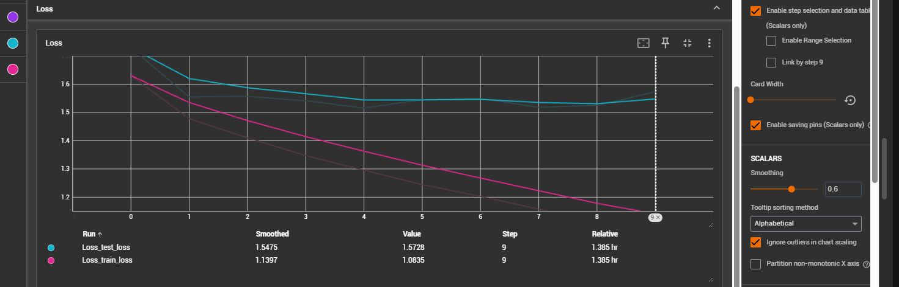

##### Experiment 3

Freeze the 3rd stage/layer and train the complete model with this configuration

1. label smoothing 0.15
2. class weights used
3. learning rate 0.0005
4. weight decay 0.01
4. lr schedular CosineAnnealingLR
5. optimizer AdamW

- epochs given - 20
- epochs completed - 6
- model final accuracy - 0.69615

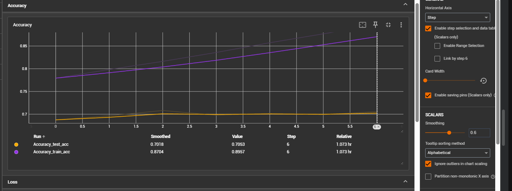
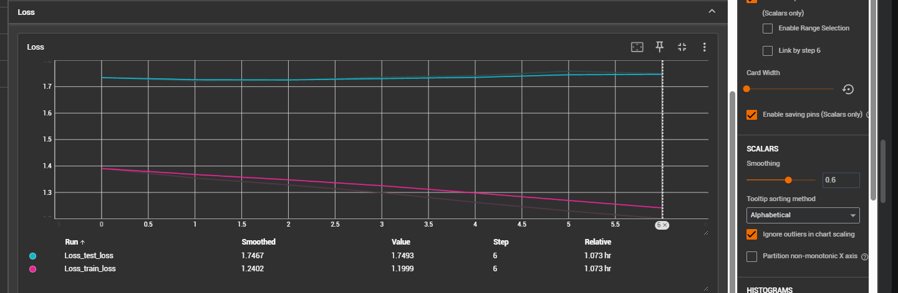

##### Experiment 4

We'll freeze the 2nd block also and train with this config

1. label smoothing 0.15
2. class weights used
3. learning rate 5e-5
4. weight decay 1e-2
4. lr schedular CosineAnnealingLR
5. optimizer AdamW

- epochs given - 20
- epochs completed - 5
- model final accuracy - 0.71022568

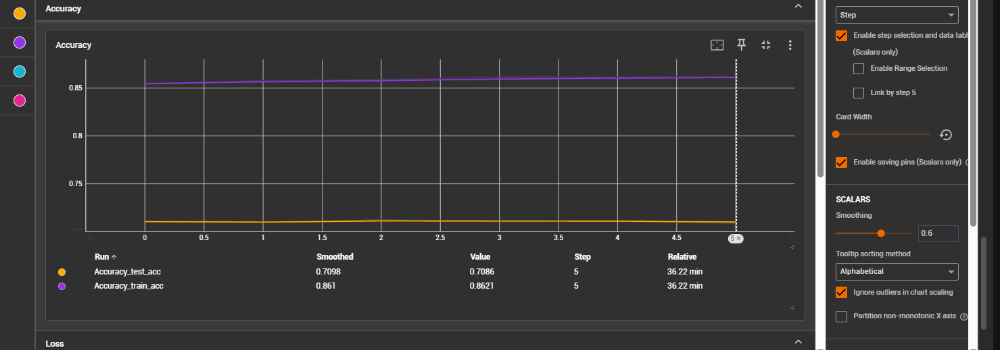
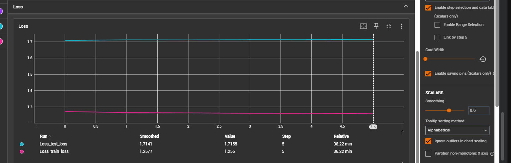

##### Experiment 5
unfreeze all layers and train complete model

1. label smoothing 0.15
2. class weights used
3. learning rate 3e-1
4. weight decay 1e-2
4. lr schedular CosineAnnealingLR
5. optimizer AdamW

- epochs given - 20
- epochs completed - 5
- model final accuracy - 0.71147952

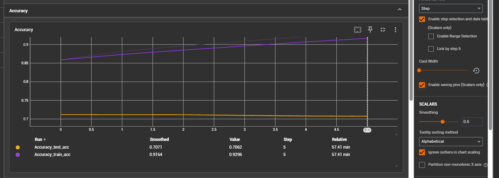
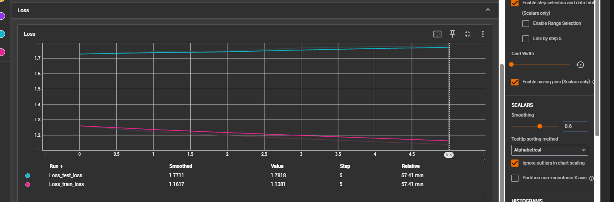

##### Experiment 6

changed schedular to ReduceLROnPleatue

1. label smoothing 0.15
2. class weights used
3. learning rate 3e-1
4. weight decay 1e-2
4. lr schedular ReduceLROnPleatue
5. optimizer AdamW

- epochs given - 20
- epochs completed - 5
- model final accuracy -  0.707578

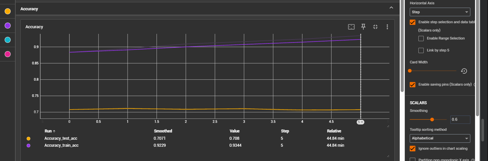
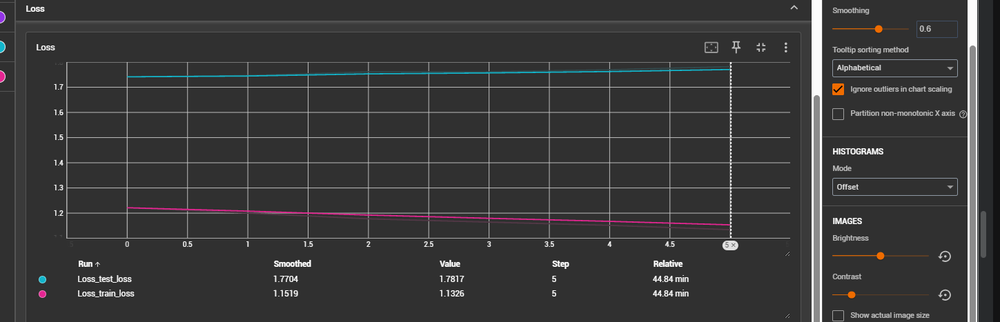

##### Experiment 7

same as experiment 6 but classw eights not used

1. label smoothing 0.15
2. class weights not used
3. learning rate 3e-1
4. weight decay 1e-2
4. lr schedular ReduceLROnPleatue
5. optimizer AdamW

- epochs given - 20
- epochs completed - 5
- model final accuracy -  0.72053496

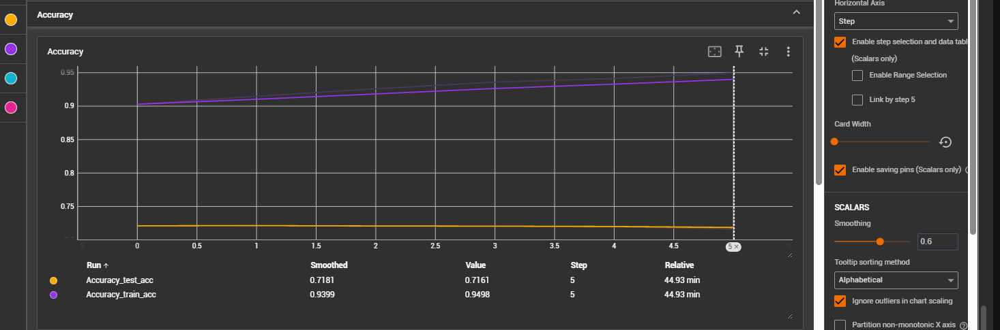
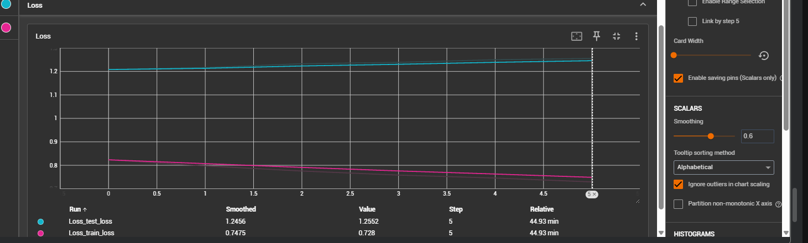