##### Experiment 1

Train the classifier

1. label smoothing 0.1
2. class weights used
3. learning rate 3e-4
4. weight decay 1e-4
4. lr schedular CosineAnnealingLR
5. optimizer AdamW

- epochs given - 3
- epochs completed -3
- model final accuracy -  0.380746

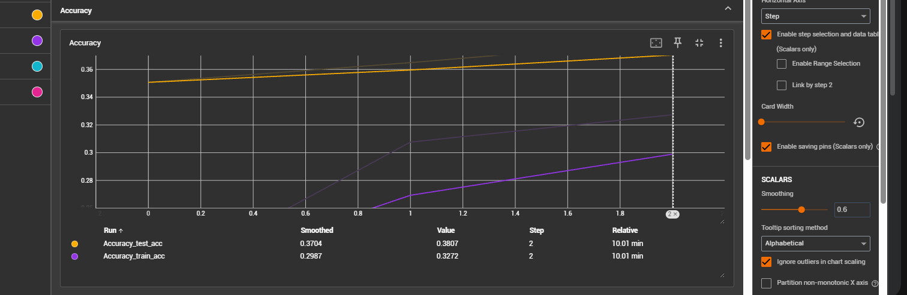
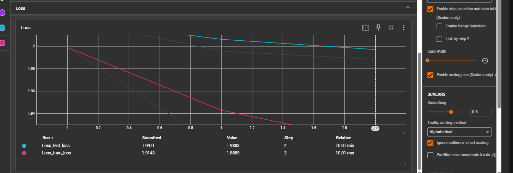

##### Experiment 2

Train the complete model with this configuration

1. label smoothing 0.1
2. class weights used
3. learning rate 3e-4
4. weight decay 1e-4
4. lr schedular CosineAnnealingLR
5. optimizer AdamW

- epochs given - 20
- epochs completed - 16
- model final accuracy -  0.6964335

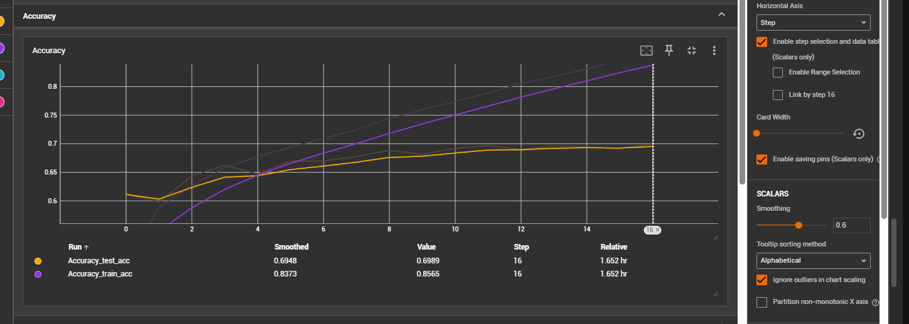
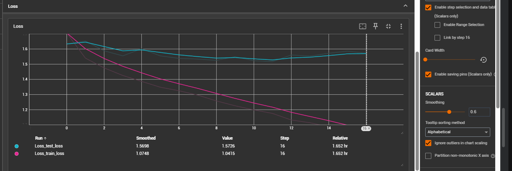

##### Experiment 3

Remove class weights

1. label smoothing 0.1
2. class weights not used 
3. learning rate 3e-4
4. weight decay 1e-4
4. lr schedular CosineAnnealingLR
5. optimizer AdamW

- epochs given - 20
- epochs completed - 6
- model final accuracy - 0.703817

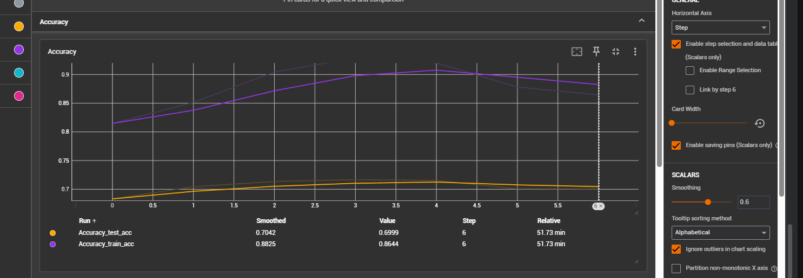
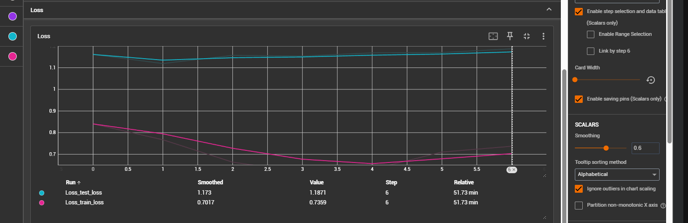

##### Experiment 4

Freeze 3rd stage layer

1. label smoothing 0.1
2. class weights not used used
3. learning rate 3e-4
4. weight decay 1e-4
4. lr schedular CosineAnnealingLR
5. optimizer AdamW

- epochs given - 20
- epochs completed - 5
- model final accuracy - 0.7146837

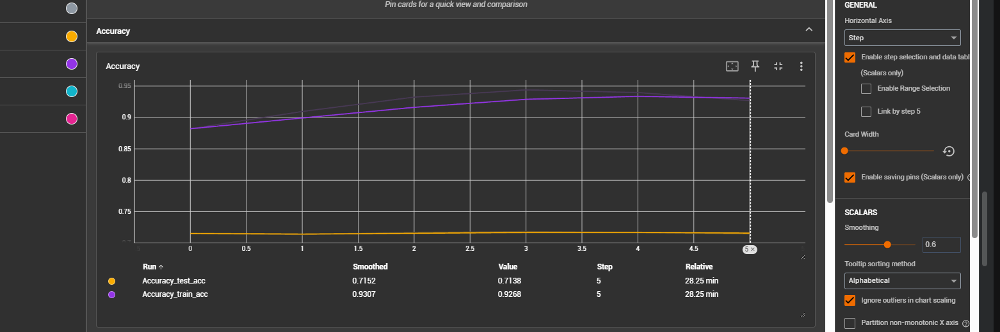
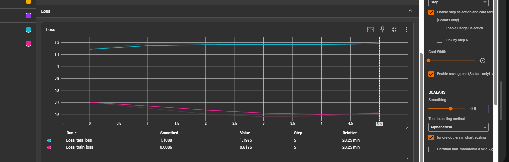

##### Experiment 5

Just train the 1st stage layer and freeze rest of all stages

1. label smoothing 0.1
2. class weights not used used
3. learning rate 3e-4
4. weight decay 1e-4
4. lr schedular CosineAnnealingLR
5. optimizer AdamW

- epochs given - 20
- epochs completed - 5
- model final accuracy - 0.7183059

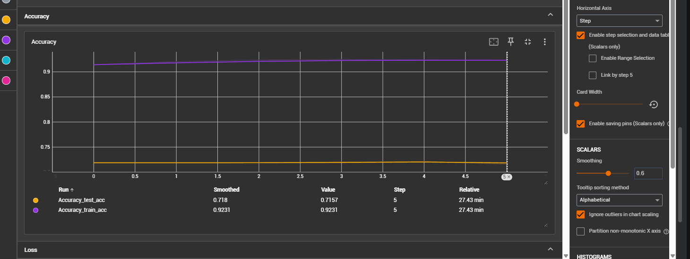
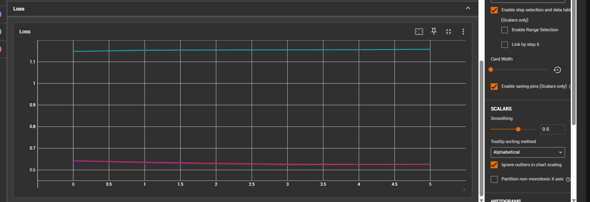

##### Experiment 6

Just train the 2nd stage layer and freeze rest of all stages

1. label smoothing 0.1
2. class weights not used used
3. learning rate 3e-4
4. weight decay 1e-4
4. lr schedular CosineAnnealingLR
5. optimizer AdamW

- epochs given - 20
- epochs completed - 6
- model final accuracy - 0.7219281

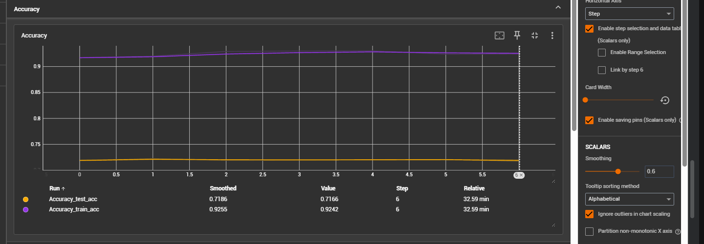
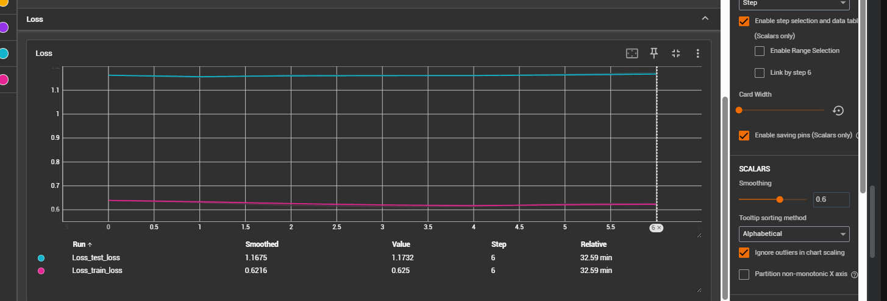

##### Experiment 7

Just train the 3rd stage layer and freeze rest of all stages

1. label smoothing 0.1
2. class weights not used used
3. learning rate 3e-4
4. weight decay 1e-4
4. lr schedular CosineAnnealingLR
5. optimizer AdamW

- epochs given - 20
- epochs completed - 6
- model final accuracy - 0.719699

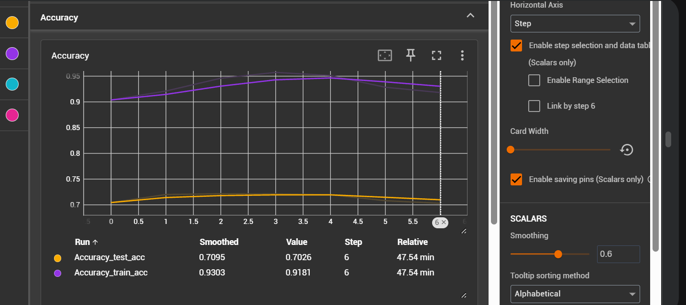
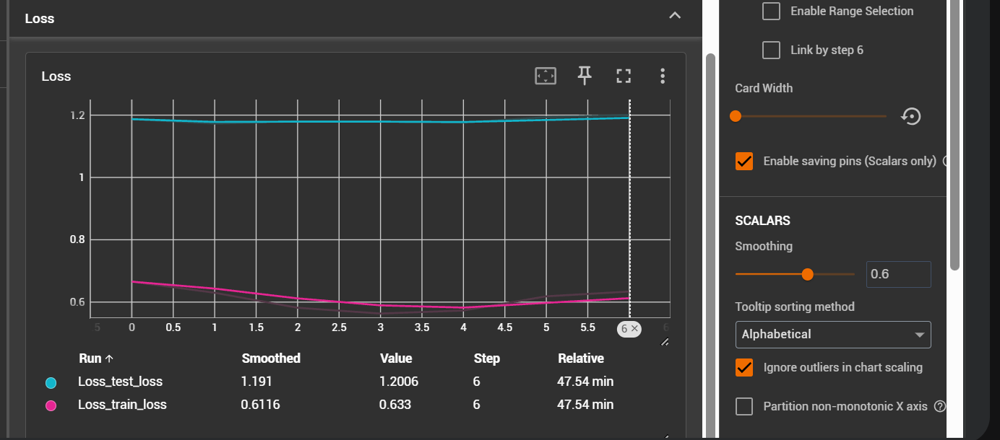

##### Experiment 8

Just train the 4th stage layer and freeze rest of all stages

1. label smoothing 0.1
2. class weights not used used
3. learning rate 3e-4
4. weight decay 1e-4
4. lr schedular CosineAnnealingLR
5. optimizer AdamW

- epochs given - 20
- epochs completed - 5
- model final accuracy - 0.714823

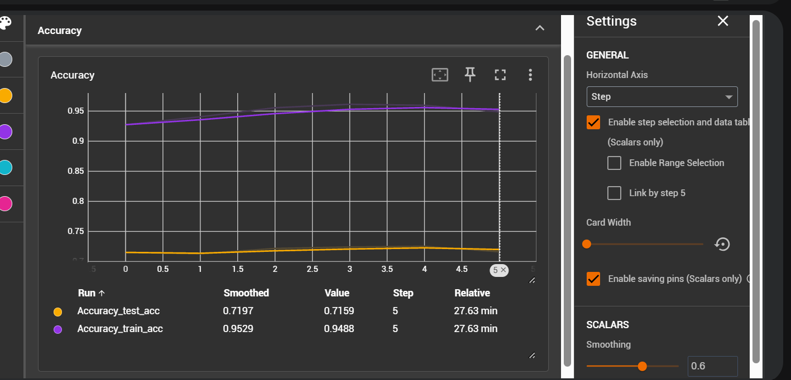
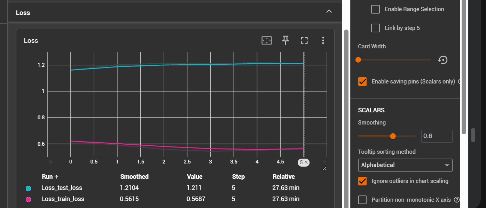

##### Experiment 9

Train complete model

1. label smoothing 0.1
2. class weights not used 
3. learning rate 3e-4
4. weight decay 1e-4
4. lr schedular CosineAnnealingLR
5. optimizer AdamW

- epochs given - 20
- epochs completed - 5
- model final accuracy - 0.714823

