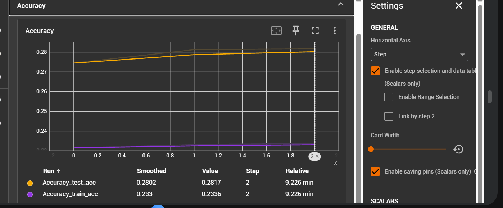
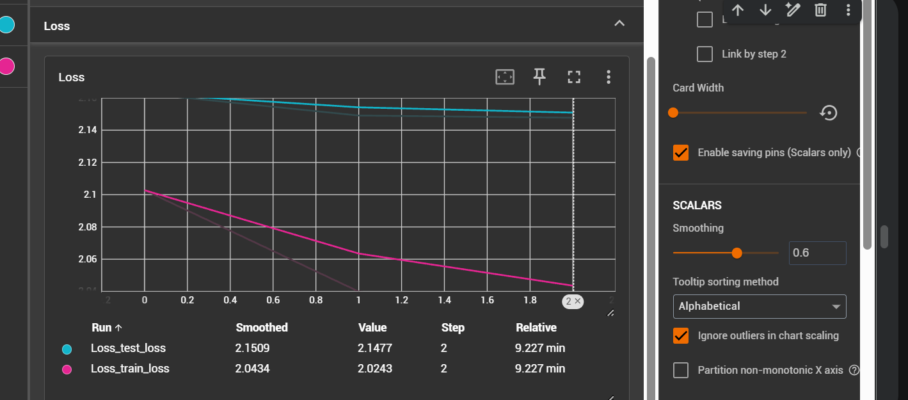
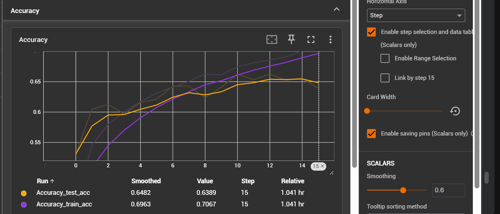
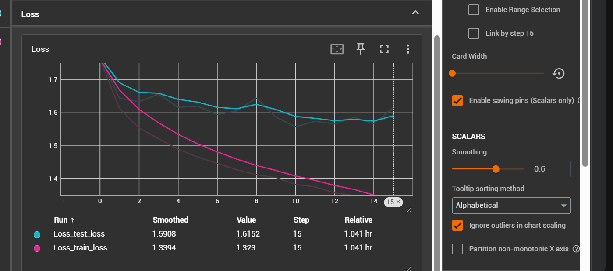
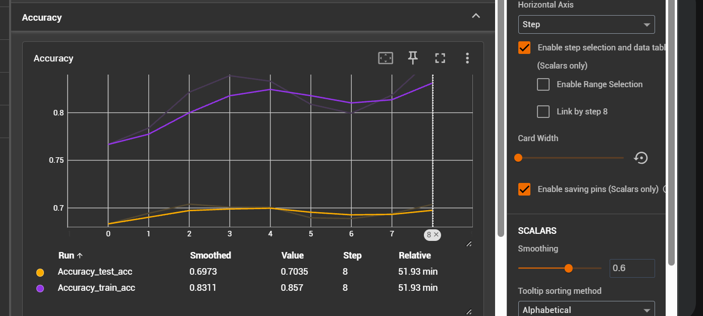
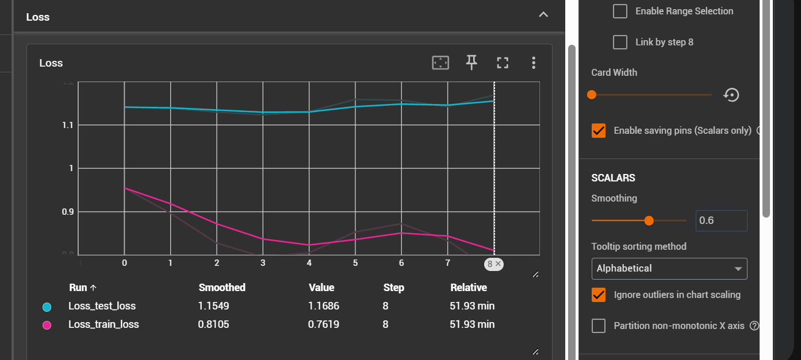
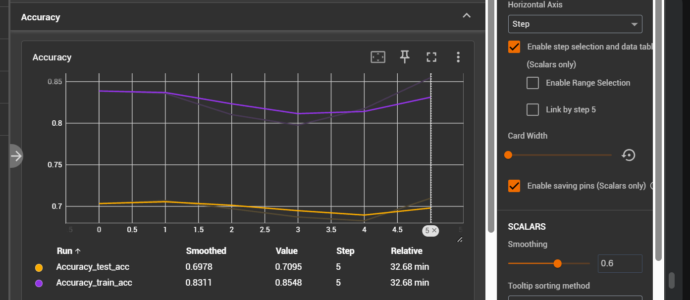
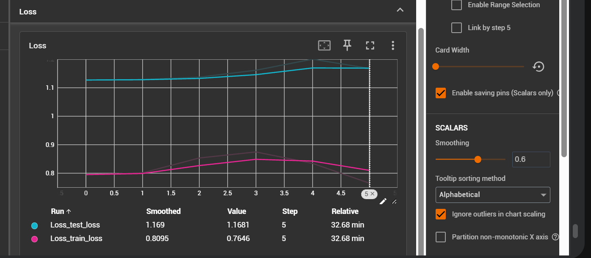

##### Experiment 1

Train the classifier

1. label smoothing 0.1
2. class weights used
3. learning rate 3e-4
4. weight decay 1e-4
4. lr schedular CosineAnnealingLR
5. optimizer AdamW

- epochs given - 3
- epochs completed -3
- model final accuracy - 0.281694

##### Experiment 2

Train the complete model with this configuration

1. label smoothing 0.1
2. class weights used
3. learning rate 3e-4
4. weight decay 1e-4
4. lr schedular CosineAnnealingLR
5. optimizer AdamW

- epochs given - 20
- epochs completed - 5
- model final accuracy - 0.68487

##### Experiment 3

Remove class weights

1. label smoothing 0.1
2. class weights used
3. learning rate 3e-4
4. weight decay 1e-4
4. lr schedular CosineAnnealingLR
5. optimizer AdamW

- epochs given - 20
- epochs completed - 8
- model final accuracy - 0.70061298

##### Experiment 4
change schedular to ReduceLROnPleatue

1. label smoothing 0.1
2. class weights used
3. learning rate 3e-4
4. weight decay 1e-4
4. lr schedular ReduceLROnPleatue
5. optimizer AdamW

- epochs given - 20
- epochs completed - 5
- model final accuracy - 0.703120

