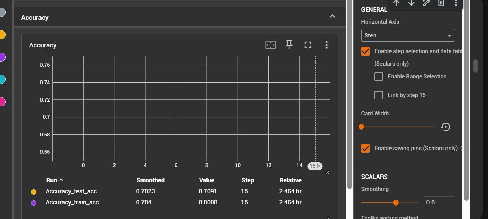
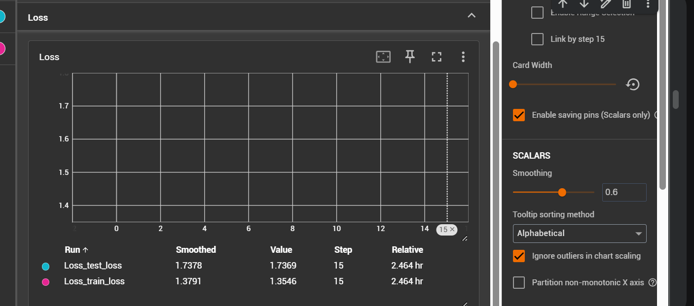
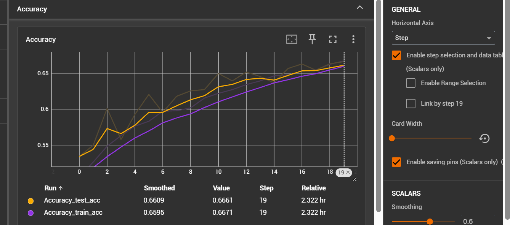
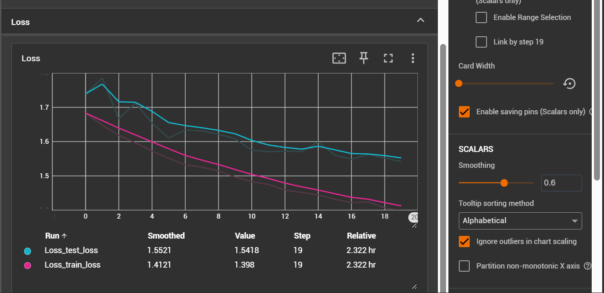
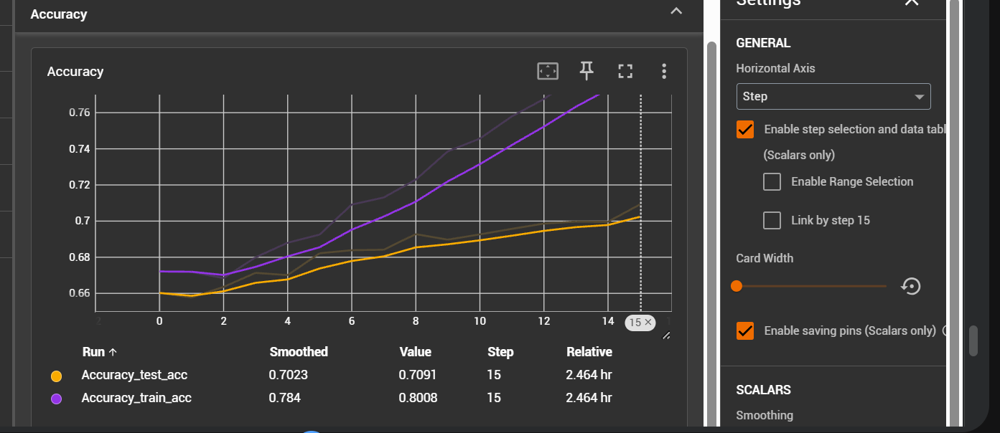
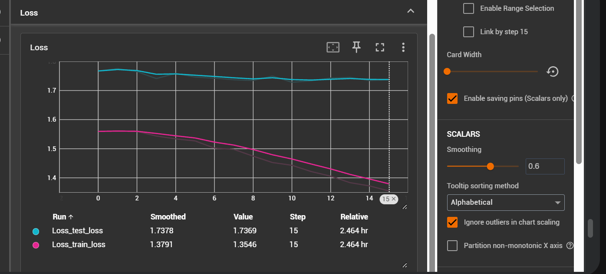

##### Experiment 1

Train the classifier

1. label smoothing 0.1
2. class weights used
3. learning rate 3e-4
4. weight decay 1e-4
4. lr schedular CosineAnnealingLR
5. optimizer AdamW

- epochs given - 3
- epochs completed - 3
- model final accuracy - 0.42713

<!-- graphs not available -->

##### Experiment 2

Train the complete model with same configuration

1. label smoothing 0.1
2. class weights used
3. learning rate 3e-4
4. weight decay 1e-4
4. lr schedular CosineAnnealingLR
5. optimizer AdamW

- epochs given - 20
- epochs completed - 20
- model final accuracy - 0.6660629

##### Experiment 3

Train the complete model with this configuration

1. label smoothing 0.15
2. class weights used
3. learning rate 0.0005
4. weight decay 0.01
4. lr schedular CosineAnnealingLR
5. optimizer AdamW

- epochs given - 20
- epochs completed - 15 
- model final accuracy - 0.692532

