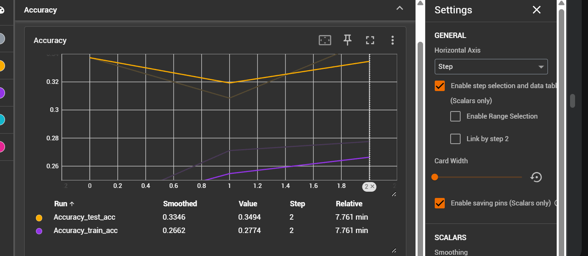
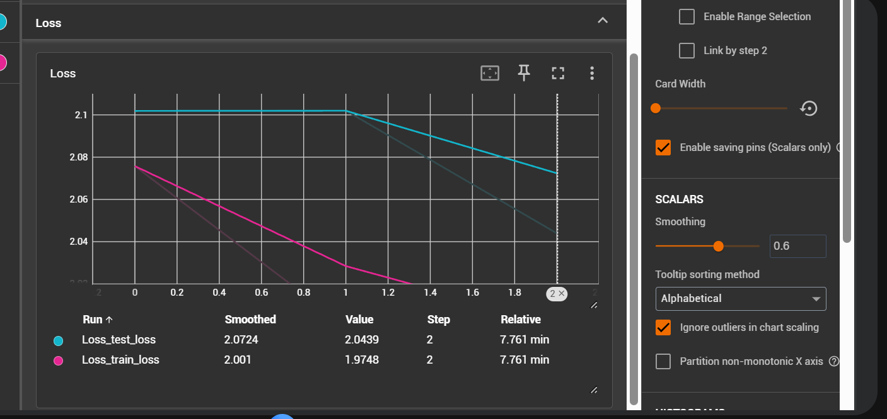
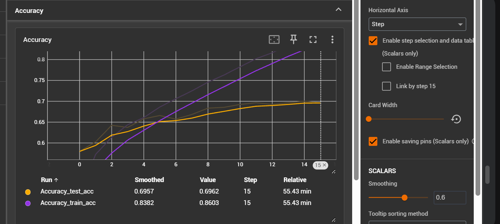
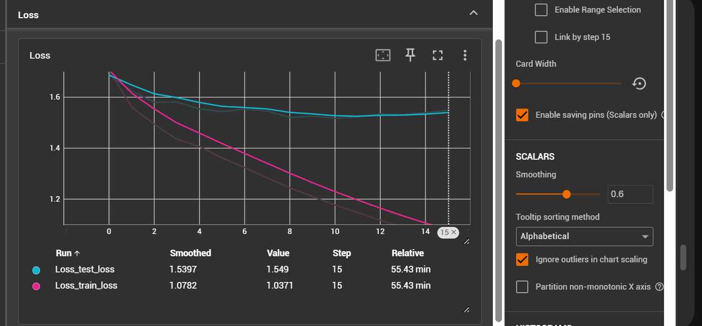
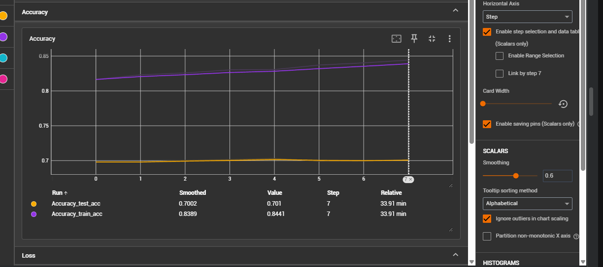
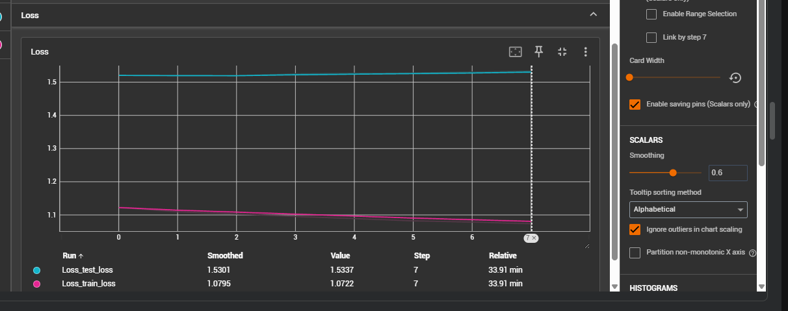
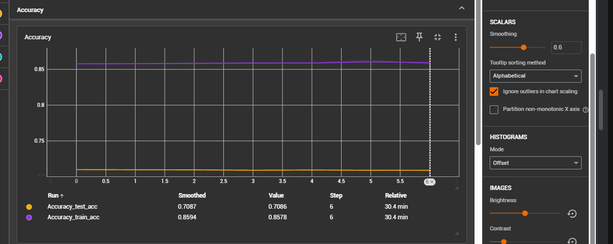
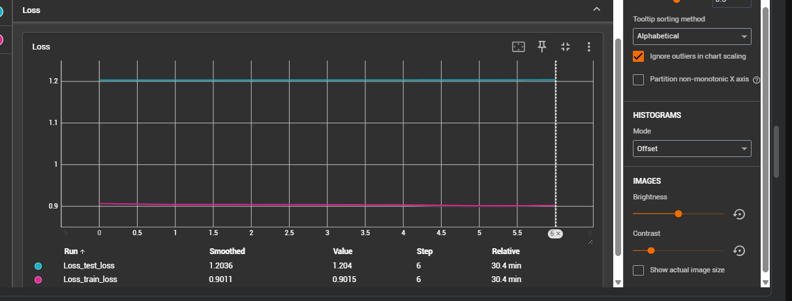

##### Experiment 1

Train the classifier

1. label smoothing 0.1
2. class weights used
3. learning rate 3e-4
4. weight decay 1e-4
4. lr schedular CosineAnnealingLR
5. optimizer AdamW

- epochs given - 3
- epochs completed - 3
- model final accuracy - 0.349400

##### Experiment 2

Train the complete model with this configuration

1. label smoothing 0.1
2. class weights used
3. learning rate 5e-5
4. weight decay 1e-2
4. lr schedular CosineAnnealingLR
5. optimizer AdamW

- epochs given - 20
- epochs completed - 15
- model final accuracy -  0.69225

##### Experiment 3

We'll freese the 1st 4 blocks and patch embedding layer

1. label smoothing 0.1
2. class weights used
3. learning rate 5e-5
4. weight decay 1e-2
4. lr schedular CosineAnnealingLR
5. optimizer AdamW

- epochs given - 20
- epochs completed - 7
- model final accuracy -  0.700055

##### Experiment 4

remove class weights

1. label smoothing 0.15
2. class weights not used
3. learning rate 5e-5
4. weight decay 1e-2
4. lr schedular CosineAnnealingLR
5. optimizer AdamW

- epochs given - 20
- epochs completed - 6
- model final accuracy -  0.7092504

