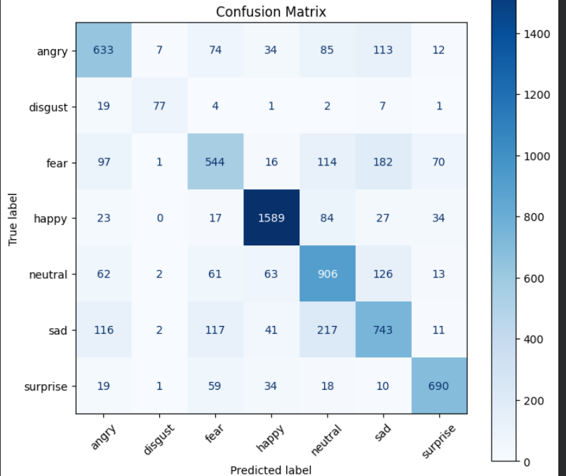
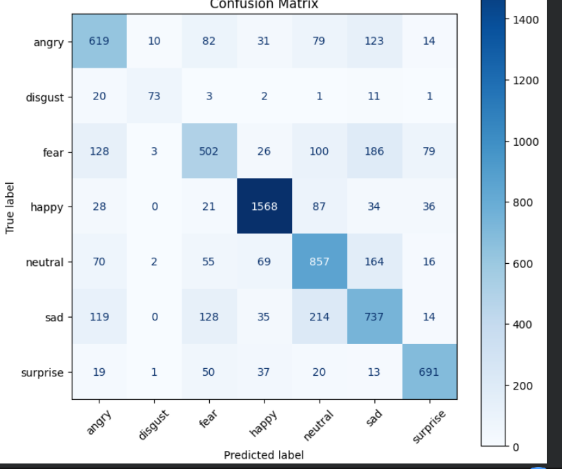
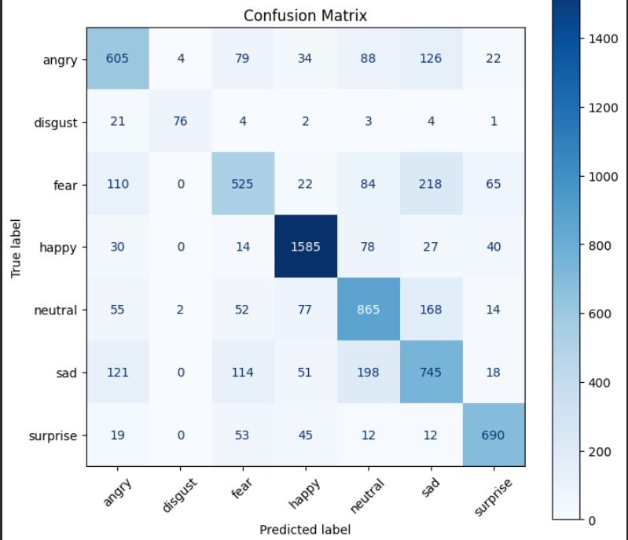
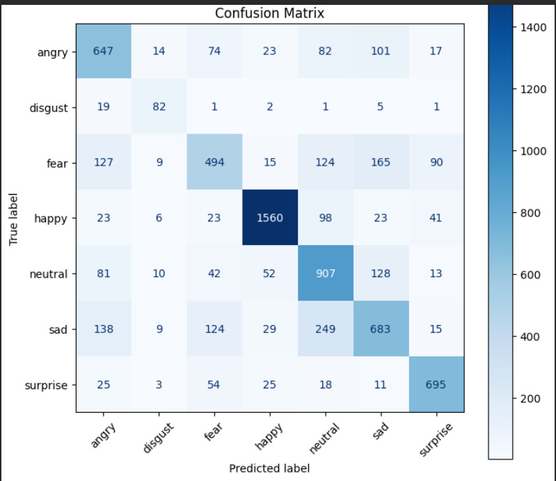

|index|model|Architecture|accuracy|loss|FLOPS|MACs|Size \(Parameters\)| Confusion Matrix |
|---|---|---|---|---|---|---|---|---|
|0|gcvit\_xxtiny|GlobalContextVit|0\.721928113680691|0\.901505248480373|3\.9 GFLOPS|1\.94 GMACs|11\.49 M| |
|1|mobilevit\_xs|ByobNet|0\.7031206464196155|0\.8810282515154945|1\.43 GFLOPS|702\.85 MMACs|1\.94 M| |
|2|vit\_tiny\_patch16\_224|VisionTransformer|0\.7092504876010031|0\.8741914588212967|2\.16 GFLOPS|1\.07 GMACs|5\.53 M| |
|3|swin\_tiny\_patch4\_window7\_224|SwinTransformer|0\.706046252438005|1\.0609434147675831|8\.73 GFLOPS|4\.35 GMACs|27\.52 M| |
|4|davit\_tiny|DaVit|0\.7205349679576484|0\.8761264638768302|8\.84 GFLOPS|4\.41 GMACs|27\.6 M| |