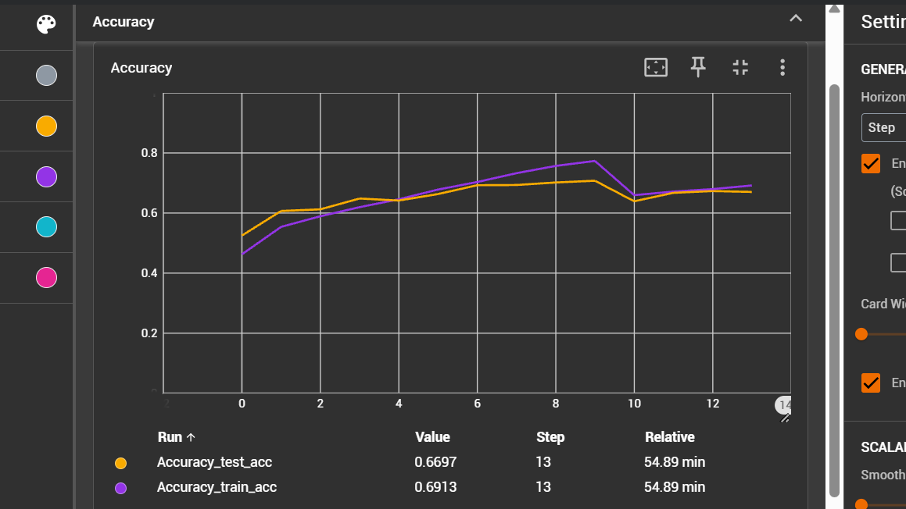
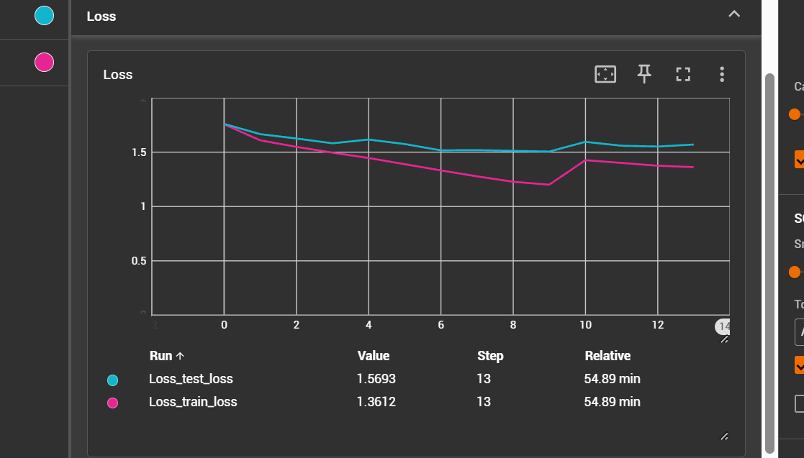
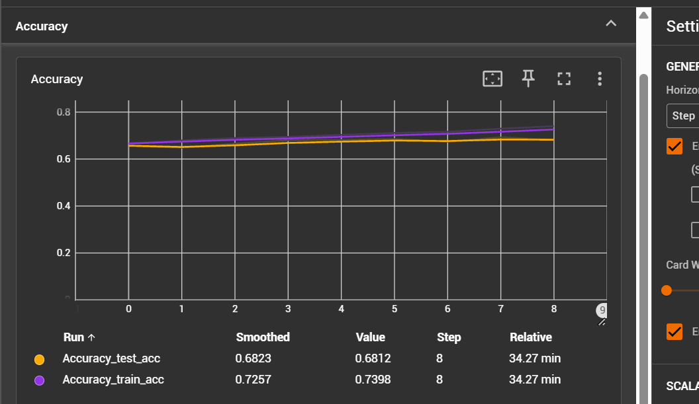
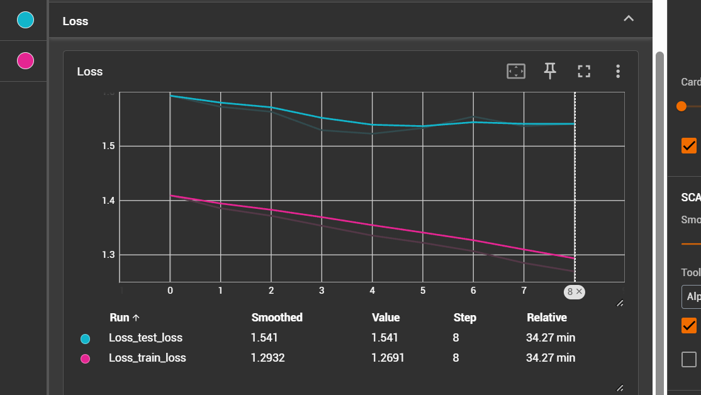
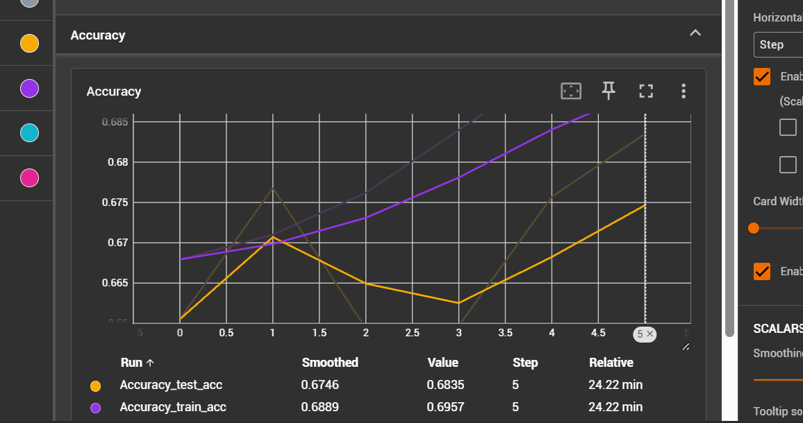
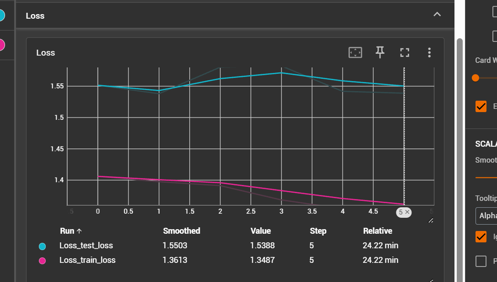
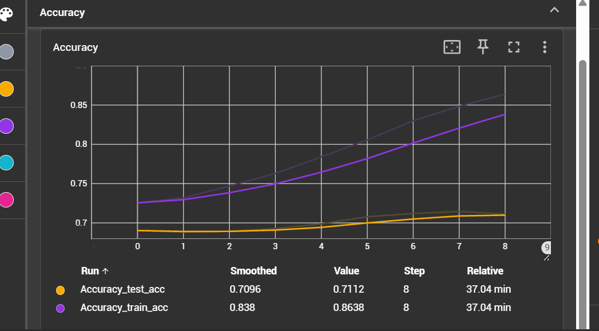
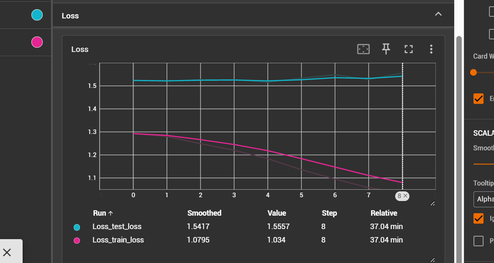

##### Experiment 1

1. label smoothing 0.1
2. class weights used
3. learning rate 0.001
4. weight decay 0.01
4. lr schedular CosineAnnealingWarmRestarts
5. optimizer AdamW

- epochs given - 20
- epochs completed - 13
- model final accuracy - 0.707021

##### Experiment 2 (metric decreased)

Increase the learning rate to 0.01 

1. label smoothing 0.1
2. class weights used
3. learning rate 0.01 -- changed
4. weight decay 0.01
4. lr schedular ReduceLROnPlateau
5. optimizer AdamW

- epochs given - 20
- epochs completed 8
- model final accuracy - 0.68138

##### experiment 3

changed optimizer to ReduceLROnPlateau

1. label smoothing 0.1
2. class weights used
3. learning rate 0.001
4. weight decay 0.01
4. lr schedular ReduceLROnPlateau -- changed
5. optimizer AdamW

- epochs given - 20
- epochs completed 5
- model final accuracy - 0.67679

##### Experiment 4

decrease the learning rate to 0.0005, schedular changed to CosineAnnealingWarmRestarts as in experiment 1

1. label smoothing 0.1
2. class weights used
3. learning rate 0.0005 -- changed
4. weight decay 0.01
4. lr schedular CosineAnnealingWarmRestarts
5. optimizer AdamW

- epochs given - 20
- epochs completed 6
- model final accuracy - 0.6985

