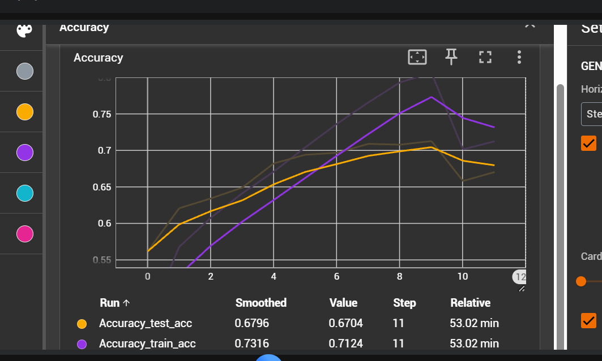
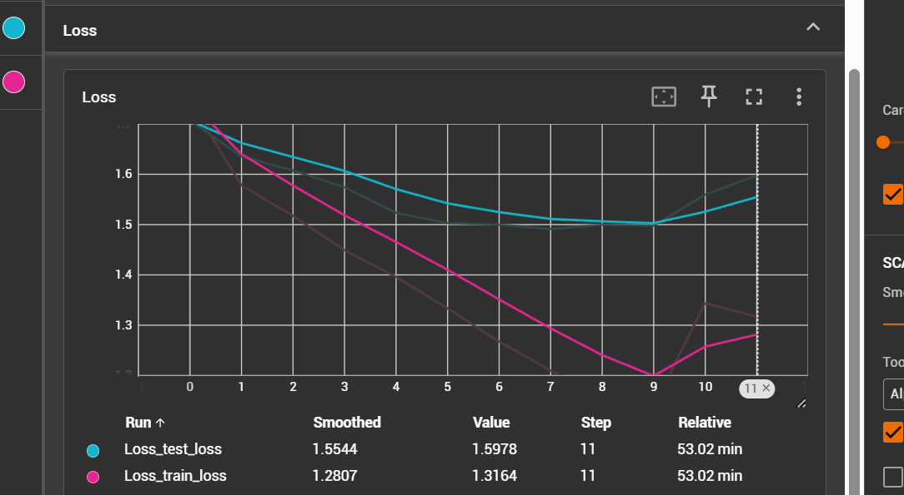
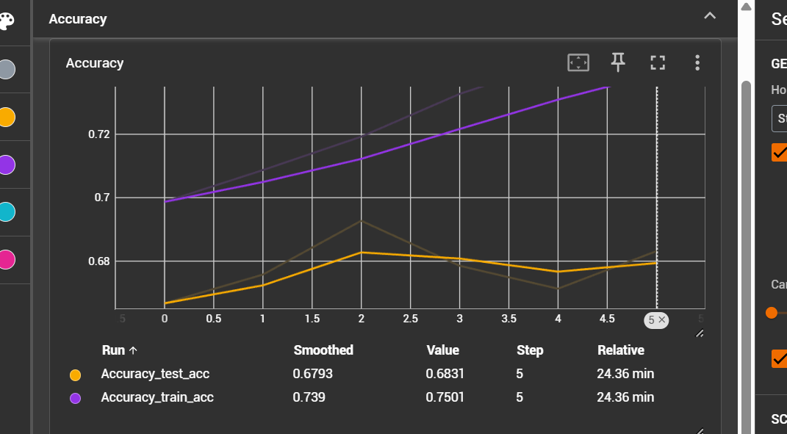
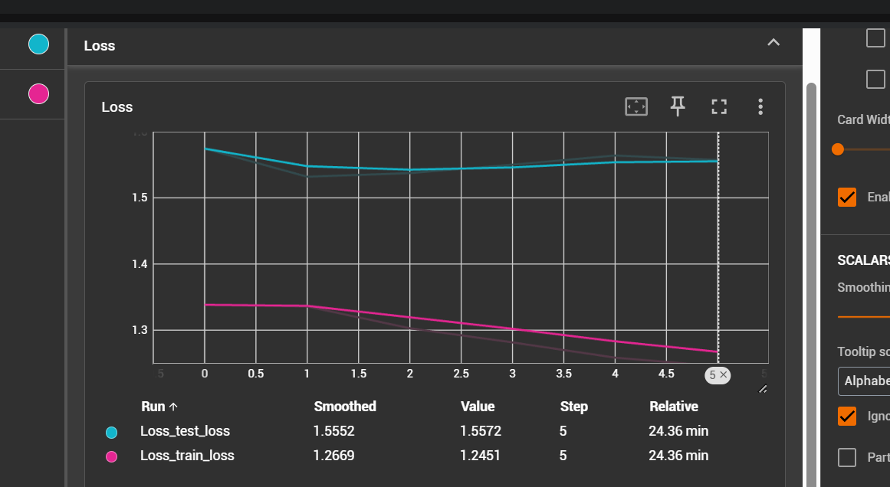
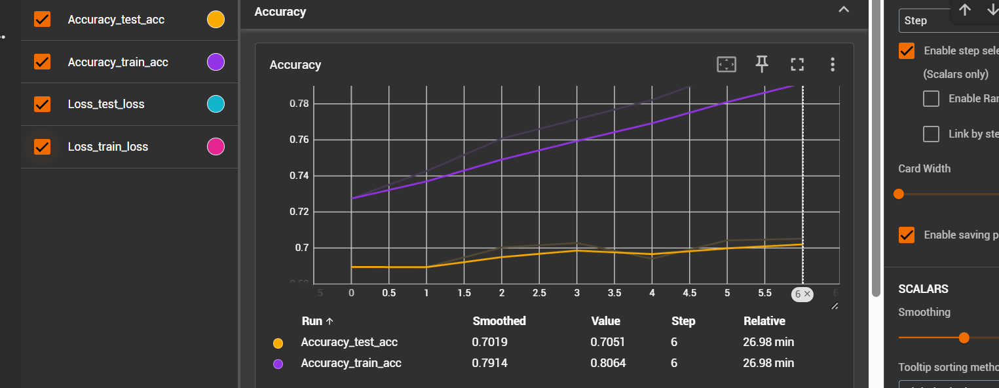
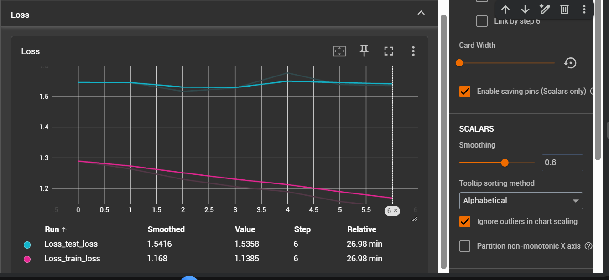
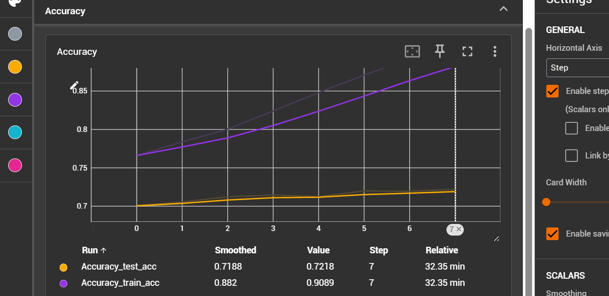
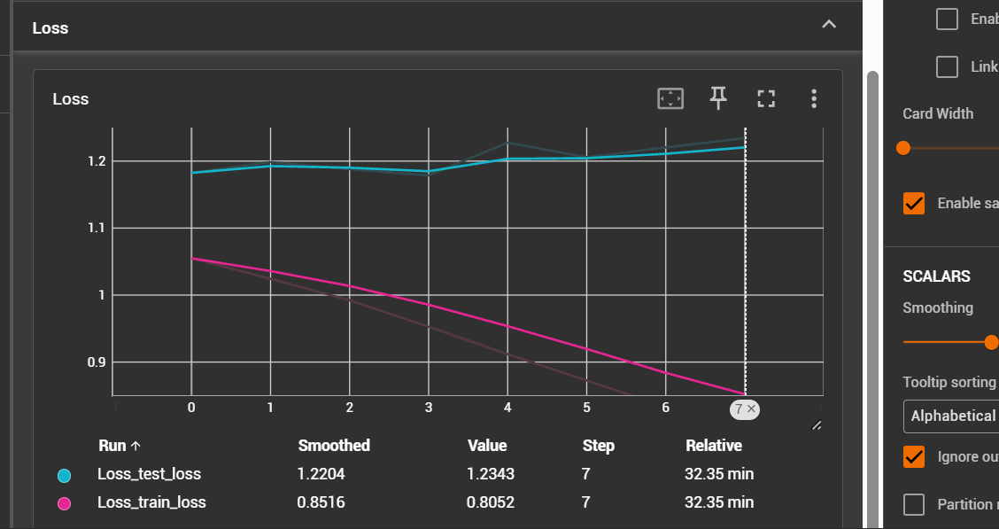
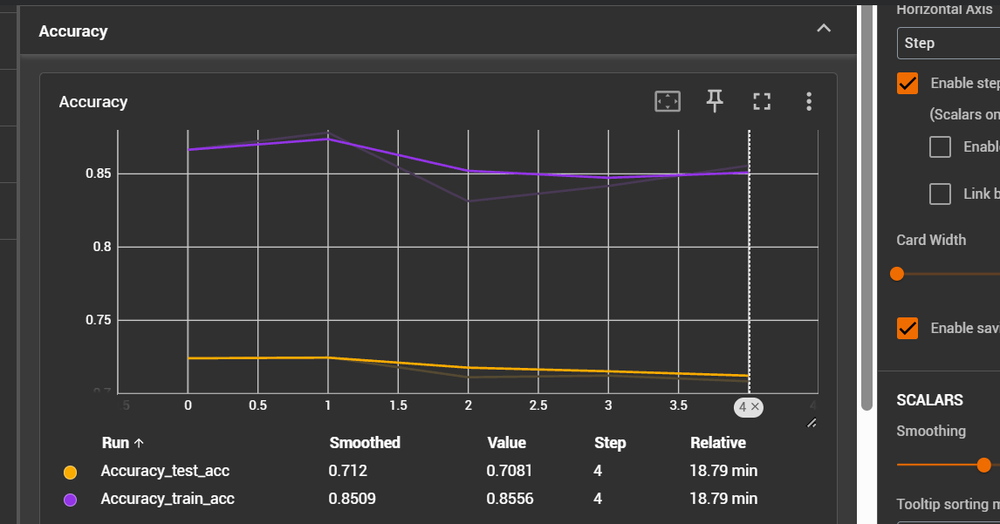
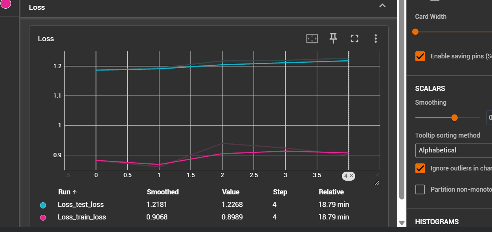

##### Experiment 1

1. label smoothing 0.1
2. class weights used
3. learning rate 0.001
4. weight decay 0.01
4. lr schedular CosineAnnealingWarmRestarts
5. optimizer AdamW

- epochs given 20
- epochs completed - 11
- model final accuracy - 0.70897 

##### Experiment 2

deccrease the learning rate to 0.0005

1. label smoothing 0.1
2. class weights used
3. learning rate 0.0005 -- changed
4. weight decay 0.01
4. lr schedular CosineAnnealingWarmRestarts
5. optimizer AdamW

- epochs given 20
- epochs completed - 5
- model final accuracy - 0.675675

##### experiment 3

changed optimizer to ReduceLROnPlateau

1. label smoothing 0.1
2. class weights used
3. learning rate 0.001
4. weight decay 0.01
4. lr schedular ReduceLROnPlateau -- changed
5. optimizer AdamW

- epochs given 20
- epochs completed - 6
- model final accuracy - 0.700195

##### experiment 4

remove class weights and change label smoothing

1. label smoothing 0.15 -- changed
2. class weights not used -- changed
3. learning rate 0.0005 -- changed
4. weight decay 0.001 -- changed
4. lr schedular CosineAnnealingWarmRestarts
5. optimizer AdamW

- epochs given 20
- epochs completed - 7
- model final accuracy - 0.7144051 

##### experiment 5

we'll repeat the experiment 4

1. label smoothing 0.15 -- changed
2. class weights not used -- changed
3. learning rate 0.0005 -- changed
4. weight decay 0.001 -- changed
4. lr schedular CosineAnnealingWarmRestarts
5. optimizer AdamW

- epochs given 20
- epochs completed - 4
- model final accuracy - 0.72387

