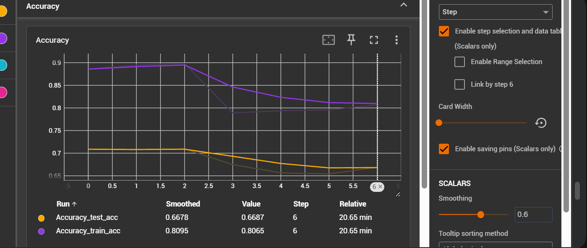
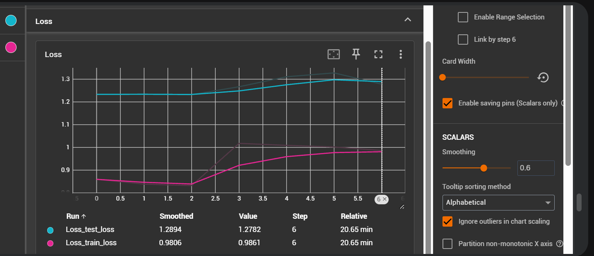

##### Experiment 1

1. label smoothing 0.1
2. class weights used
3. learning rate 0.001
4. weight decay 0.01
4. lr schedular CosineAnnealingWarmRestarts
5. optimizer AdamW

- epochs given 10
- epochs completed - 10
- model final accuracy -  0.69030 

