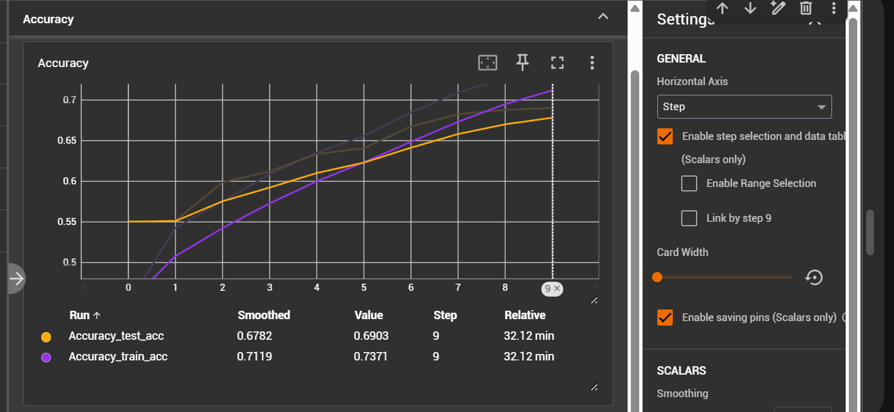
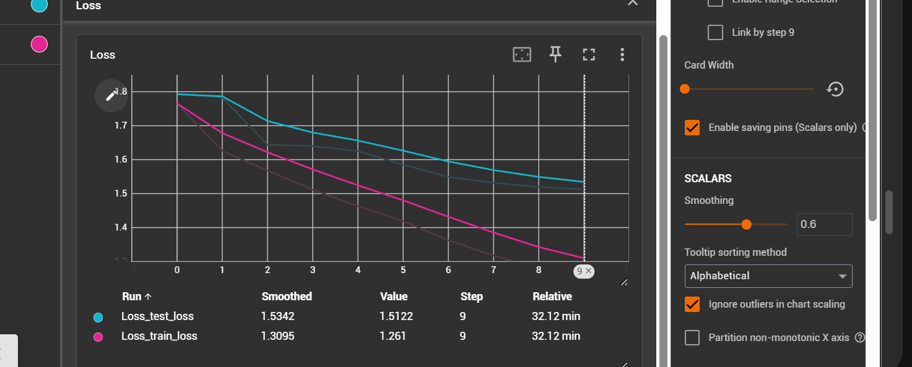
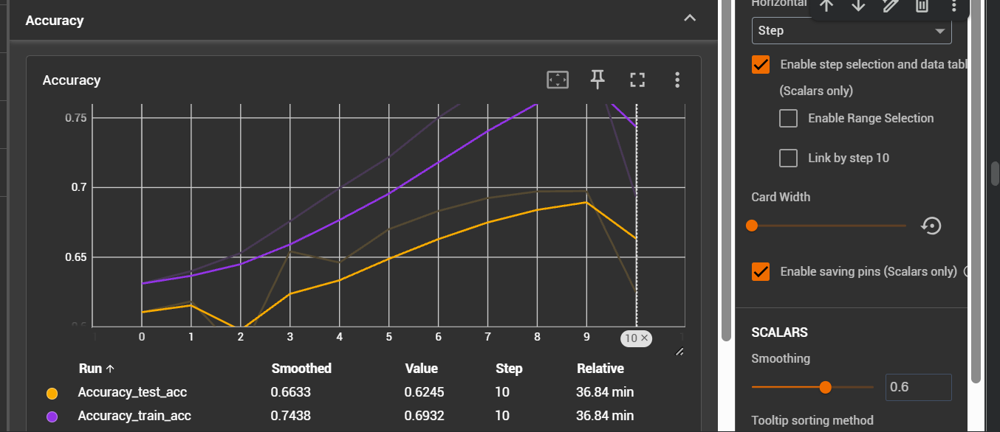
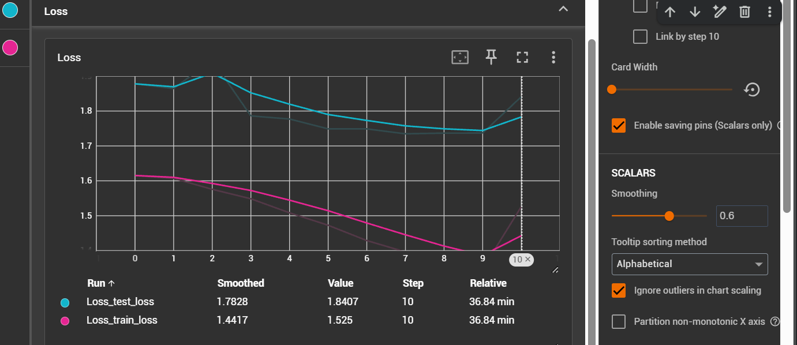
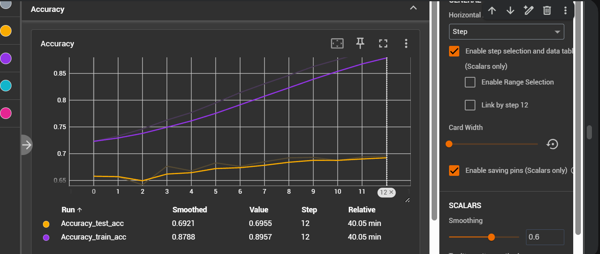
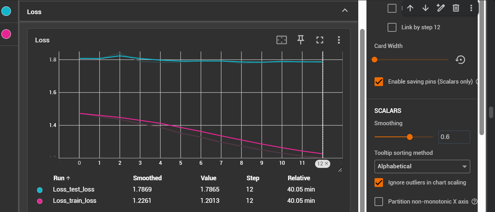

##### Experiment 1

1. label smoothing 0.1
2. class weights used
3. learning rate 0.001
4. weight decay 0.01
4. lr schedular CosineAnnealingWarmRestarts
5. optimizer AdamW

- epochs given 10
- epochs completed - 10
- model final accuracy -  0.69030 

##### Experiment 2

label smoothing value changed to 0.15

1. label smoothing 0.15 -- changed
2. class weights used
3. learning rate 0.001
4. weight decay 0.01
4. lr schedular CosineAnnealingWarmRestarts
5. optimizer AdamW

- epochs given 20
- epochs completed - 11
- model final accuracy -  0.692393

##### Experiment 3

change schedular 

1. label smoothing 0.15 
2. class weights used
3. learning rate 0.001
4. weight decay 0.01
4. lr schedular ReduceLROnPlateau -- changed
5. optimizer AdamW

- epochs given 20
- epochs completed - 12
- model final accuracy -  0.691975

##### Experiment 4

dont use class weights

1. label smoothing 0.15 
2. class weights not used -- changed
3. learning rate 0.001
4. weight decay 0.01
4. lr schedular ReduceLROnPlateau -- changed
5. optimizer AdamW

- epochs given 20
- epochs completed - 6
- model final accuracy - 0.70911

