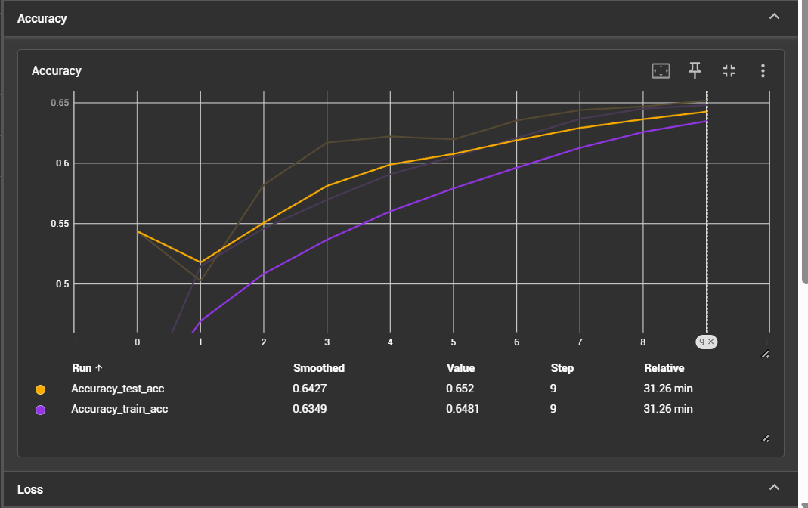
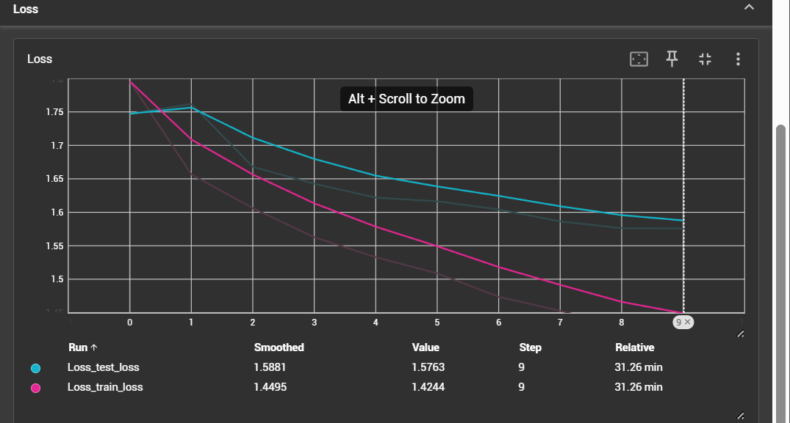
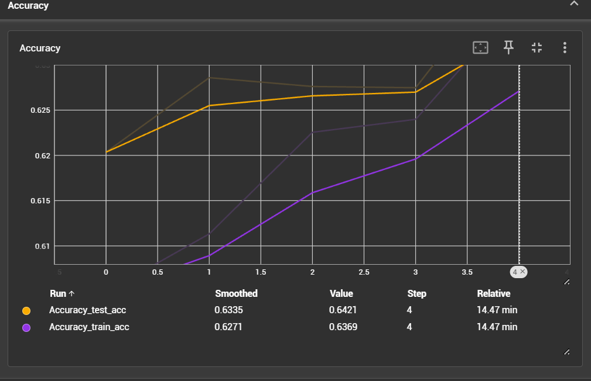
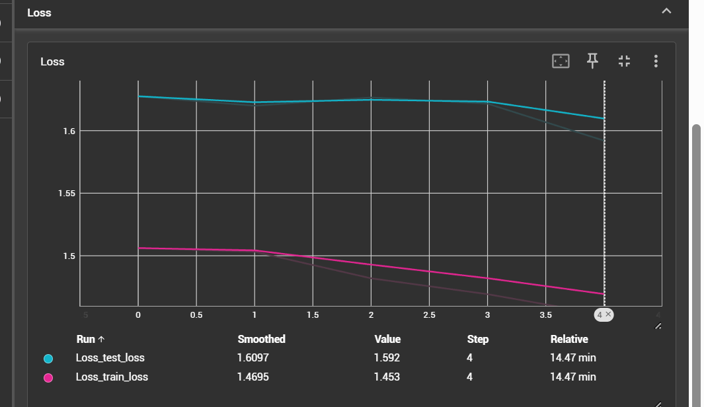
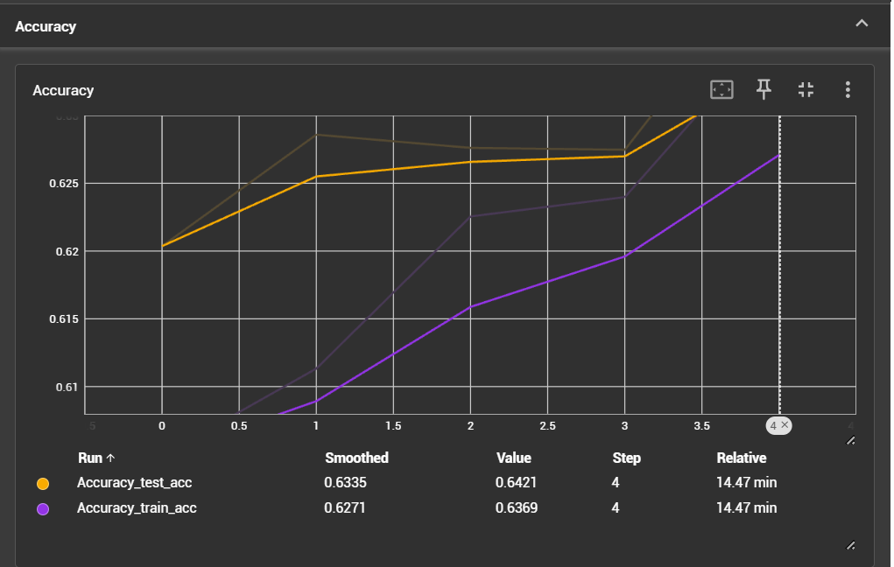
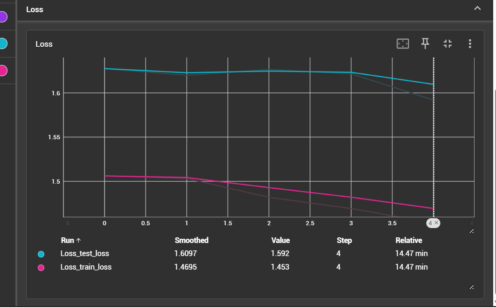
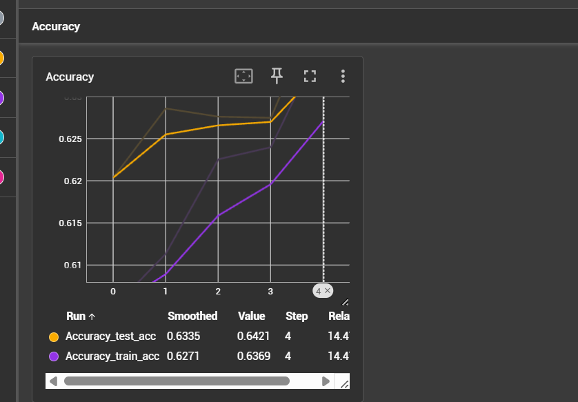
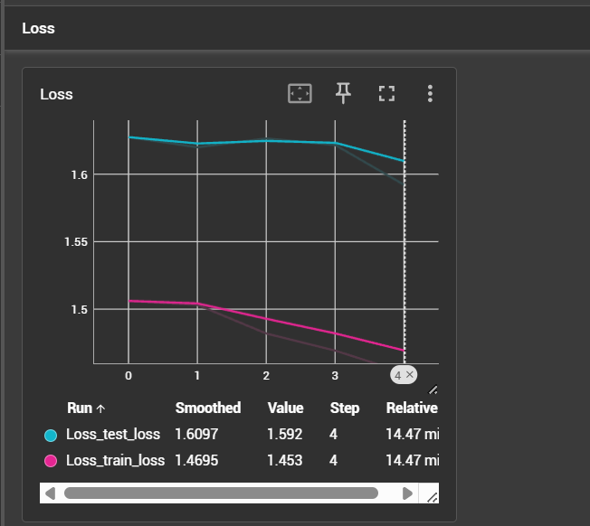
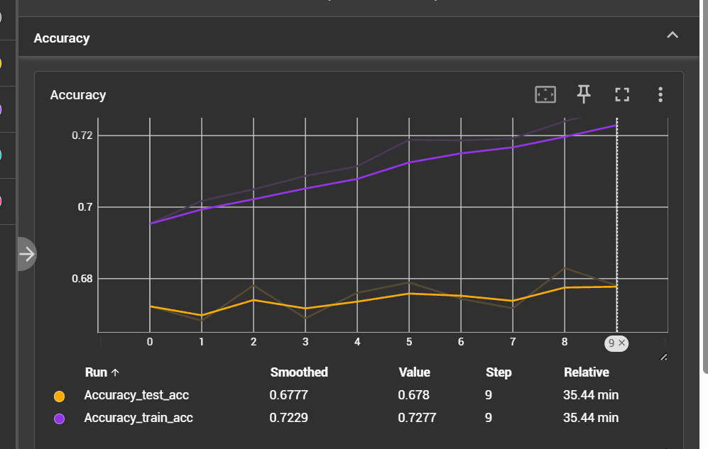
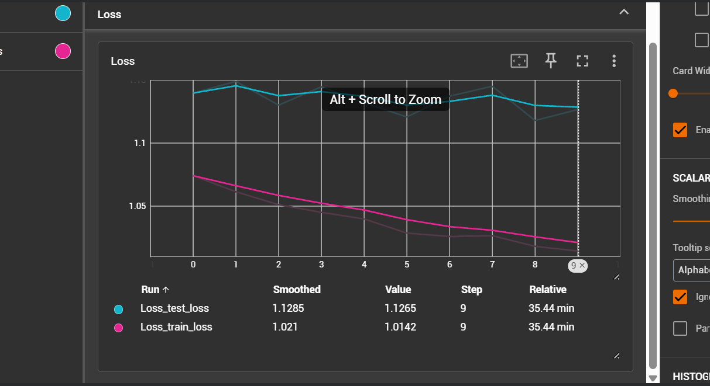

##### Experiment 1

1. label smoothing 0.1
2. class weights used
3. learning rate 0.001
4. weight decay 0.01
4. lr schedular CosineAnnealingWarmRestarts
5. optimizer AdamW 

##### Experiment 2 (metric didnot improve)

we'll use same setup for 5 more because accuracy increased each epoch consistently 

1. label smoothing 0.1
2. class weights used
3. learning rate 0.001
4. weight decay 0.01
4. lr schedular CosineAnnealingWarmRestarts
5. optimizer AdamW 

##### Experiment 3 (metric improved)
chnage learning rate schedular from CosineAnnealingWarmRestarts to ReduceLROnPlateau and removed class weights in loss function

1. label smoothing 0.1 
2. class weights not used
3. learning rate 0.001
4. weight decay 0.01
4. lr schedular ReduceLROnPlateau
5. optimizer AdamW 

##### Experiment 4 (early stopping - metric not improved)
we'll use same setup of eperiment 3 for 10 more epochs because accuracy increased each epoch consistently

1. label smoothing 0.1
2. class weights not used
3. learning rate 0.001
4. weight decay 0.01
4. lr schedular ReduceLROnPlateau
5. optimizer AdamW 

##### Experiment 5
just changed learning rate to 0.1 and rest use same setup of eperiment 3, 4 

1. label smoothing 0.1
2. class weights not used
3. learning rate 0.01
4. weight decay 0.01
4. lr schedular ReduceLROnPlateau
5. optimizer AdamW

