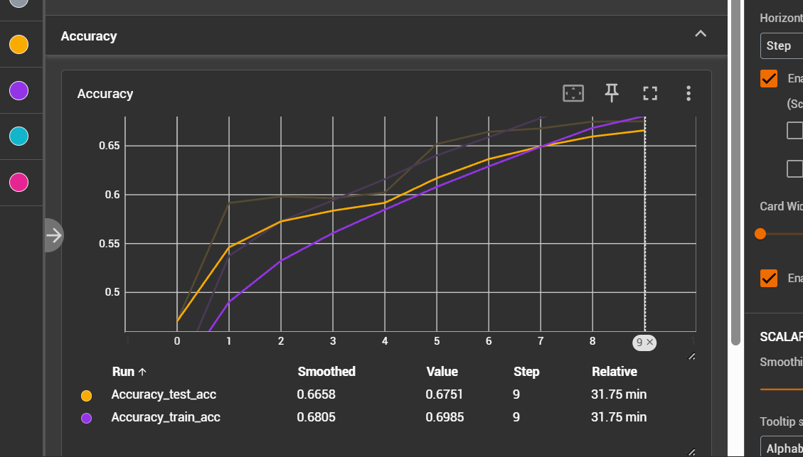
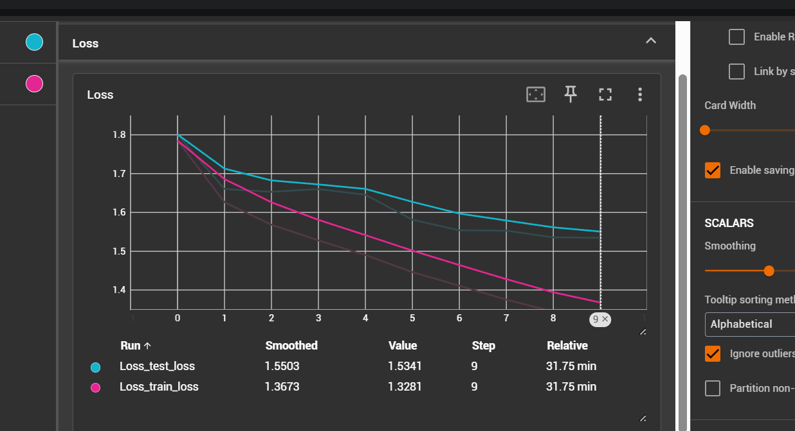
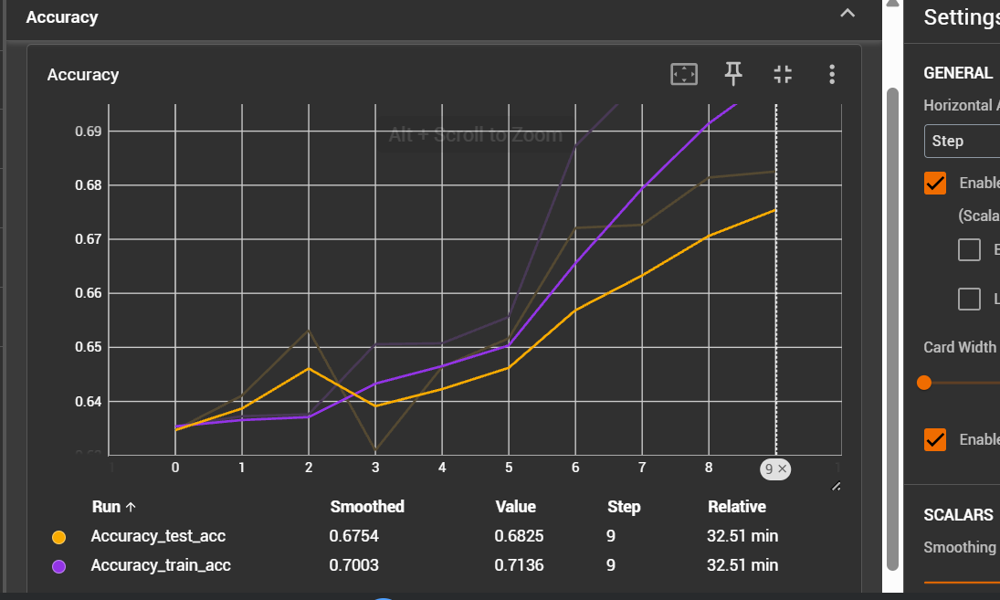
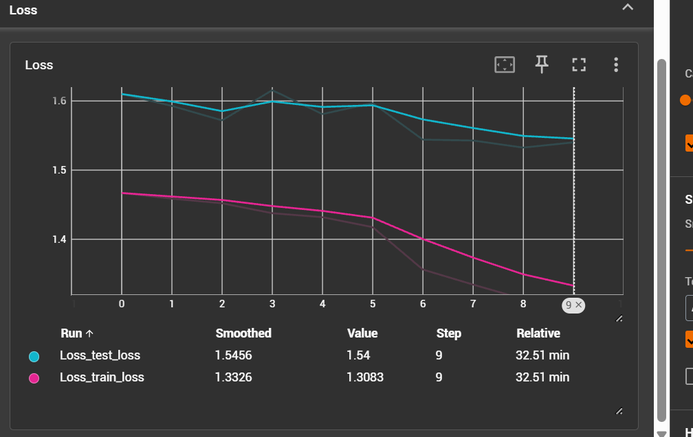
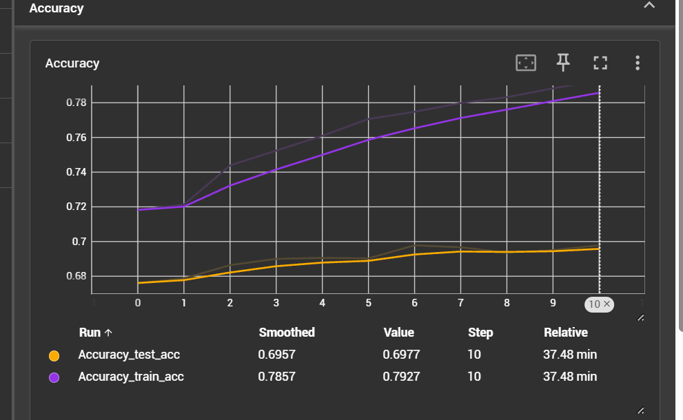
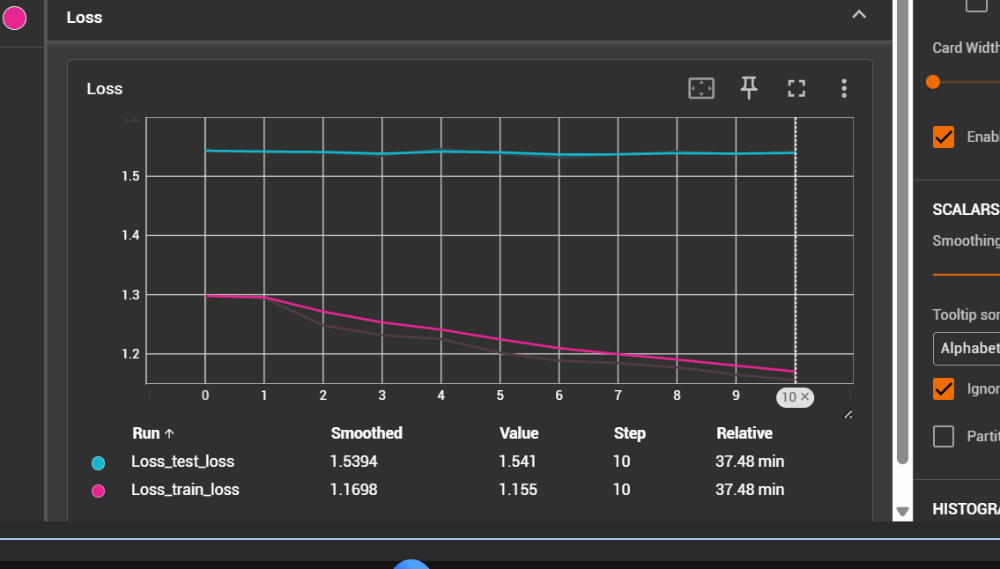

##### Experiment 1

1. label smoothing 0.1
2. class weights used
3. learning rate 0.001
4. weight decay 0.01
4. lr schedular CosineAnnealingWarmRestarts
5. optimizer AdamW 

##### Experiment 2 (metric improved)
change schedular from CosineAnnealingWarmRestarts
ReduceLROnPlateau

1. label smoothing 0.1
2. class weights used
3. learning rate 0.001
4. weight decay 0.01
4. lr schedular ReduceLROnPlateau
5. optimizer AdamW

##### Experiment 3 (metric improved)
repeated experiment 2 with more epochs

1. label smoothing 0.1
2. class weights used
3. learning rate 0.001
4. weight decay 0.01
4. lr schedular ReduceLROnPlateau
5. optimizer AdamW

##### Experiment 4

increase the learning rate to 0.01

1. label smoothing 0.1
2. class weights used
3. learning rate 0.01
4. weight decay 0.01
4. lr schedular ReduceLROnPlateau
5. optimizer AdamW

