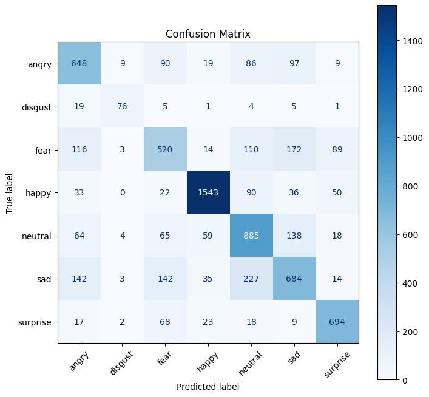
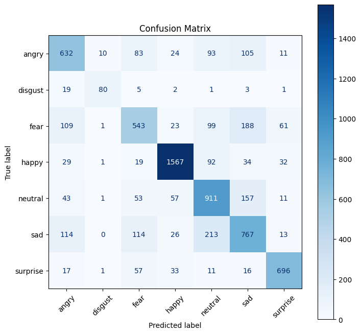

| index | model              | Architecture | accuracy            | loss                | FLOPS          | MACs          | Size \(Parameters\) | Confusion Matrix                                                          |
| ----- | ------------------ | ------------ | ------------------- | ------------------- | -------------- | ------------- | ------------------- | ------------------------------------------------------------------------- |
| 0     | mobilenet_v3_small | MobileNetV3  | 0\.7091111730286987 | 0\.9051066817177666 | 114\.6 MFLOPS  | 55\.49 MMACs  | 1\.53 M             |  |
| 1     | shufflenet_v2_x0_5 | ShuffleNetV2 | 0\.6829200334354973 | 0\.8954495419396294 | 82\.09 MFLOPS  | 39\.46 MMACs  | 348\.97 K           |  |
| 2     | shufflenet_v2_x1_0 | ShuffleNetV2 | 0\.7035385901365283 | 0\.8951992658774058 | 293\.47 MFLOPS | 143\.89 MMACs | 1\.26 M             |  |
| 3     | efficientnet_b0    | EfficientNet | 0\.7070214544441349 | 0\.9830353075928159 | 791\.1 MFLOPS  | 384\.54 MMACs | 4\.02 M             |     |
| 4     | efficientnet_b1    | EfficientNet | 0\.7238785176929506 | 0\.8524766141838498 | 1\.17 GFLOPS   | 568\.38 MMACs | 6\.52 M             |     |
